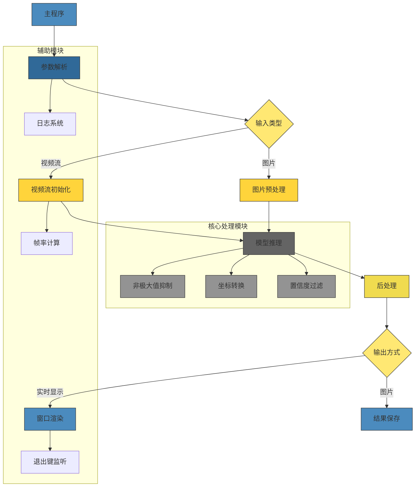

```mermaid
graph TD

A[主程序] --> B[参数解析]
B --> C{输入类型}
C -->|图片| D[图片预处理]
C -->|视频流| E[视频流初始化]

D --> F[模型推理]
E --> F

F --> G[后处理]
G --> H{输出方式}
H -->|图片| I[结果保存]
H -->|实时显示| J[窗口渲染]

subgraph 核心处理模块
F --> K[非极大值抑制]
F --> L[坐标转换]
F --> M[置信度过滤]
end

subgraph 辅助模块
B --> N[日志系统]
E --> O[帧率计算]
J --> P[退出键监听]
end

style A fill:#4B8BBE,stroke:#333
style B fill:#306998,stroke:#333
style C fill:#FFE873,stroke:#333
style D fill:#FFD43B,stroke:#333
style E fill:#FFD43B,stroke:#333
style F fill:#646464,stroke:#333
style G fill:#F0DB4F,stroke:#333
style H fill:#FFE873,stroke:#333
style I fill:#4B8BBE,stroke:#333
style J fill:#4B8BBE,stroke:#333
style K fill:#939393,stroke:#333
style L fill:#939393,stroke:#333
style M fill:#939393,stroke:#333

click B "https://github.com/mindspore-lab/mindyolo/blob/master/demo/predict.py#L21" _blank
click F "https://github.com/mindspore-lab/mindyolo/blob/master/demo/predict.py#L346" _blank

```