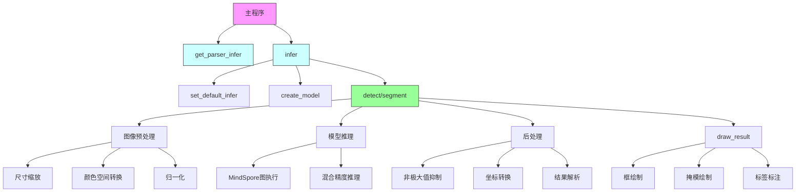

```mermaid
graph TD
    A[主程序] --> B[get_parser_infer]
    A --> C[infer]
    C --> D[set_default_infer]
    C --> E[create_model]
    C --> F[detect/segment]
    
    F --> G[图像预处理]
    F --> H[模型推理]
    F --> I[后处理]
    
    G --> G1[尺寸缩放]
    G --> G2[颜色空间转换]
    G --> G3[归一化]
    
    H --> H1[MindSpore图执行]
    H --> H2[混合精度推理]
    
    I --> I1[非极大值抑制]
    I --> I2[坐标转换]
    I --> I3[结果解析]
    
    F --> J[draw_result]
    J --> J1[框绘制]
    J --> J2[掩模绘制]
    J --> J3[标签标注]
    
    style A fill:#f9f,stroke:#333
    style B fill:#cff,stroke:#333
    style C fill:#cff,stroke:#333
    style F fill:#9f9,stroke:#333
```