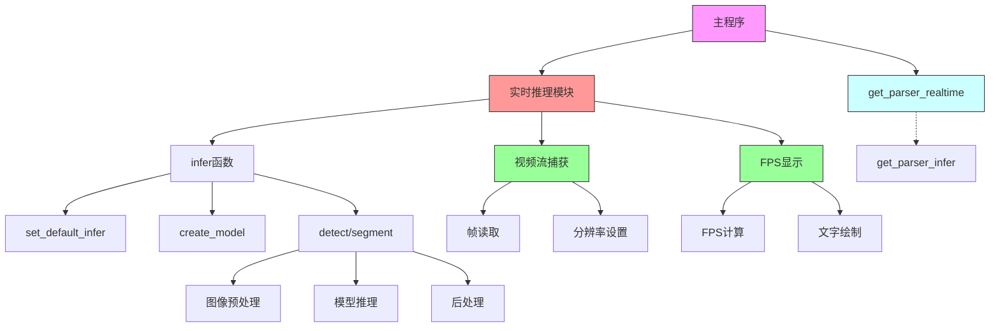

```mermaid
graph TD
    Main[主程序] --> RealtimeInfer[实时推理模块]
    Main --> GetParserRealtime[get_parser_realtime]
    
    RealtimeInfer --> VideoCapture[视频流捕获]
    RealtimeInfer --> Infer[infer函数]
    RealtimeInfer --> FpsDisplay[FPS显示]
    
    GetParserRealtime -.-> GetParserInfer[get_parser_infer]
    Infer --> SetDefaultInfer[set_default_infer]
    Infer --> CreateModel[create_model]
    Infer --> DetectSegment[detect/segment]
    
    DetectSegment --> Preprocess[图像预处理]
    DetectSegment --> ModelInfer[模型推理]
    DetectSegment --> Postprocess[后处理]
    
    VideoCapture --> FrameRead[帧读取]
    VideoCapture --> FrameResize[分辨率设置]
    FpsDisplay --> CalcFPS[FPS计算]
    FpsDisplay --> DrawText[文字绘制]
    
    style Main fill:#f9f,stroke:#333
    style RealtimeInfer fill:#f99,stroke:#333
    style GetParserRealtime fill:#cff,stroke:#333
    style VideoCapture fill:#9f9,stroke:#333
    style FpsDisplay fill:#9f9,stroke:#333
```